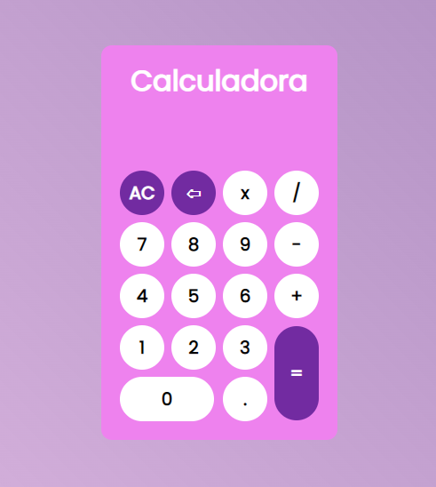

## 🧮 Calculadora Simples com JS, HTML E CSS

</img>  
Você pode conferir também <a href="https://pedrosaito1.github.io/calculadora/" target="_blank">aqui</a>.

## Objetivo do projeto:

Exercitar a linguagem JS junto com HTML e CSS.  

## Funcionalidades do projeto:

✅ Executar cálculos de soma, subtração, divisão e multiplicação  
✅ Apagar caracteres digitados errados  
✅ Limpar dados da tela  

## Tecnologias usadas: 

◾ HTML  
◾ CSS  
◾ JavaScript  

## Autor:

Pedro Saito  

</img> 

<a href="https://www.linkedin.com/in/pedrosaito1/" target="_blank">Linkedin</a>
